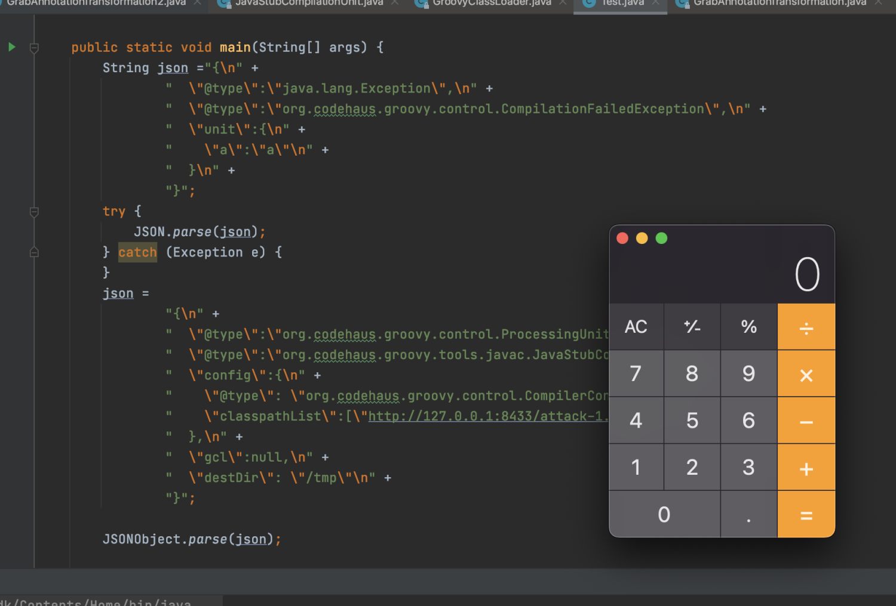

# fastjson <83 RCE 漏洞复现

##利用条件
- fastjson版本： 1.2.76 <= fastjson < 1.2.83
- 存在groovy依赖

##复现步骤
1.编译attack 模块为 attack-1.jar包

2.在attack-1.jar包所在的目录下执行启用http服务。

`python -m SimpleHTTPServer 8433`

3.运行poc

